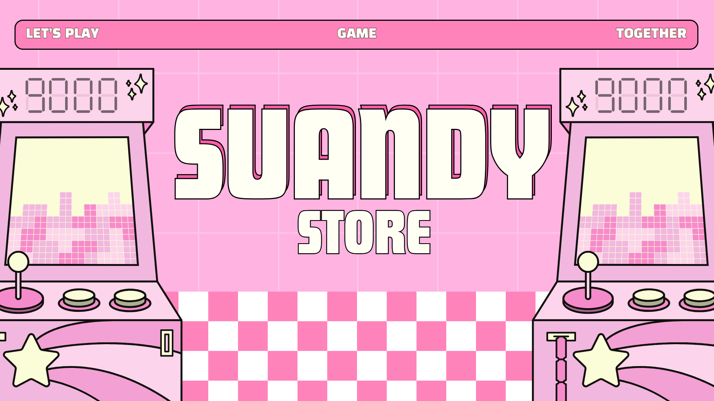

# PHP Game Store

A simple PHP-based web application for listing and selling game accounts.

## Features

-   **User Management:** User registration and login system.
-   **Admin Panel:** A dedicated section for administrators to manage users, game listings, and view orders.
-   **Game Listings:** Admins can create, update, and delete game account listings.
-   **Image Uploads:** Support for multiple images per listing.
-   **Ordering System:** Users can place orders for available game accounts.

## Technologies Used

-   **Backend:** PHP
-   **Database:** MySQL / MariaDB
-   **Frontend:** HTML, CSS, JavaScript (no major frameworks)

## Project Structure

```
.
├── admin_*.php         # Admin panel files
├── database/
│   ├── migration.sql
│   └── suandy_store.sql # Database dump
├── uploads/             # Directory for uploaded listing images
├── auth.php             # Authentication functions
├── db.php               # Database connection
├── setup_database.php   # Script for initial database setup
├── index.php            # Main/home page
├── listing.php          # View all listings
├── listing_detail.php   # View a single listing
├── login.php            # User login
├── register.php         # User registration
├── ...and other PHP files
```

## Setup Instructions

1.  **Clone the repository or download the source code.**

2.  **Web Server:**
    -   You will need a local web server with PHP and MySQL support. XAMPP, WAMP, or MAMP are good options.
    -   Place the project files in the web server's root directory (e.g., `htdocs` for XAMPP).

3.  **Database Setup:**

    You can set up the database in one of two ways:

    **Method 1: Using the Setup Script (Recommended for a fresh start)**
    -   Make sure your MySQL server is running.
    -   Open `db.php` and verify the database credentials (`$host`, `$user`, `$pass`). By default, it's set for a standard XAMPP installation (user `root` with no password).
    -   The script will try to create a database named `suandy_store`.
    -   Navigate to `http://localhost/your-project-folder/setup_database.php` in your web browser.
    -   This script will create the necessary tables and seed an admin user.
    -   **IMPORTANT:** For security reasons, you must delete the `setup_database.php` file after the setup is complete.

    **Method 2: Manual Import**
    -   Create a new database in your MySQL server (e.g., via phpMyAdmin) and name it `suandy_store`.
    -   Import the `database/suandy_store.sql` file into your newly created database.

4.  **Running the Application:**
    -   Navigate to `http://localhost/your-project-folder/` in your browser.
    -   You can log in with the default admin credentials to manage the store.
        -   **Email:** `admin@gamestore.com`
        -   **Password:** `admin123`

## Database Schema

The database consists of the following main tables:

-   `users`: Stores user information, including an `is_admin` flag.
-   `listings`: Contains details about each game account for sale.
-   `listing_images`: Stores paths to images associated with each listing.
-   `orders`: Tracks orders placed by users.
-   `auth_tokens`: Used for "remember me" functionality.

Relationships are established using foreign keys. For a detailed schema, please refer to the `database/suandy_store.sql` file.

## Screenshots

Below are a few sample images from the application.

### Cover Image

*The main cover image used on the homepage.*

### Header

*A header image used within the application.*

### Application Screenshot
.png)
*A screenshot demonstrating the application's user interface.*

