# Game Store - Platform Jual Beli Game Digital

Dibuat oleh:
**SUANDY - 221011400816 - TPLP020**

## Deskripsi Proyek

**Game Store** adalah sebuah aplikasi web platform _e-commerce_ yang dirancang khusus untuk para gamer. Aplikasi ini memungkinkan pengguna untuk tidak hanya membeli game digital tetapi juga menjual game mereka sendiri dalam bentuk "listing". Platform ini memfasilitasi seluruh siklus transaksi, mulai dari pendaftaran pengguna, pembuatan dan pengelolaan listing, hingga proses pemesanan dan konfirmasi.

Aplikasi ini juga dilengkapi dengan panel administrasi yang kuat, memberikan kontrol penuh kepada admin untuk mengelola pengguna, memantau laporan penjualan, dan mengatur status pesanan. Arsitekturnya dibangun menggunakan tumpukan teknologi web klasik (PHP, MySQL, HTML/CSS/JS), menjadikannya solusi yang mudah dipahami dan dikelola.

## Video Demo

Tonton demo lengkap aplikasi di YouTube:

[](https://youtu.be/7wZFoGxL4ho?si=SjvHtrYC5zrwEAbx)

Link: [https://youtu.be/7wZFoGxL4ho](https://youtu.be/7wZFoGxL4ho)

## Teknologi yang Digunakan

- **Backend**: PHP (Native)
- **Database**: MySQL
- **Frontend**: HTML, CSS, JavaScript (Vanilla)
- **Web Server**: Apache (Biasanya dijalankan melalui lingkungan pengembangan seperti XAMPP)

## Struktur Proyek

```
c:\xampp\htdocs\game-store\
├─── admin_*.php            # Kumpulan file untuk fitur panel admin
├─── auth.php               # Logika inti untuk autentikasi sesi pengguna
├─── create_listing.php     # Halaman form untuk membuat listing baru
├─── db.php                 # Skrip koneksi ke database MySQL
├─── delete_listing.php     # Skrip untuk menghapus listing
├─── edit_listing.php       # Halaman form untuk mengedit listing
├─── footer.php             # Komponen UI/template untuk bagian footer
├─── header.php             # Komponen UI/template untuk bagian header
├─── index.php              # Halaman utama (beranda) aplikasi
├─── listing_detail.php     # Halaman untuk menampilkan detail satu listing
├─── listing.php            # Halaman untuk menampilkan semua listing
├─── login.php              # Halaman login pengguna
├─── logout.php             # Skrip untuk proses logout
├─── order_*.php            # Kumpulan file untuk manajemen pesanan sisi pengguna
├─── register.php           # Halaman registrasi pengguna baru
├─── script.js              # File JavaScript untuk interaktivitas di sisi klien
├─── setup_database.php     # Skrip untuk inisialisasi database awal
├─── side_bar.php           # Komponen UI/template untuk sidebar navigasi
├─── .git/                  # Direktori repositori Git
├─── database/              # Berisi file dump SQL (struktur dan data)
│   └─── migration.sql
│   └─── suandy_store.sql
├─── img/                   # Aset gambar statis untuk UI dan dokumentasi
└─── uploads/               # Direktori untuk menyimpan gambar yang di-upload pengguna (cover game)
```

## Detail Fitur & Tampilan Aplikasi

Bagian ini menjelaskan secara detail setiap fitur utama dari aplikasi, lengkap dengan prasyarat dan alur prosesnya.

---

### Halaman Utama (`index.php`)

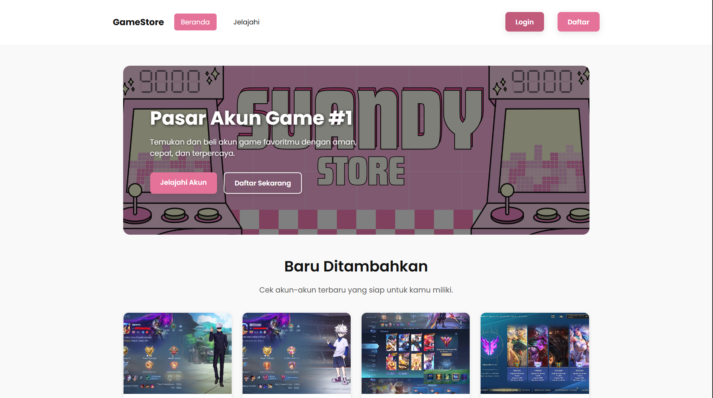

Halaman ini adalah fasad digital dari Game Store, titik pertama interaksi bagi semua pengunjung. Desainnya bersih dan terfokus untuk memandu pengguna ke area-area paling relevan dari situs.

-   **Prasyarat:** Tidak ada. Halaman ini sepenuhnya publik dan dapat diakses oleh siapa saja dengan koneksi internet.
-   **Detail Elemen UI:**
    -   **Header Navigasi:** Berisi link-link vital: `Beranda` untuk kembali ke halaman ini, `Listing` untuk menjelajahi semua produk, serta `Login` dan `Register` untuk manajemen akun.
    -   **Konten Utama:** Biasanya menampilkan daftar produk unggulan, promosi khusus, atau game yang baru ditambahkan untuk menarik perhatian pengguna.
-   **Alur Proses &amp; Hasil:**
    1.  Pengguna membuka URL situs.
    2.  Halaman Beranda dimuat, menampilkan navigasi utama.
    3.  Pengguna dapat mengklik `Listing` untuk langsung melihat katalog produk, atau mengklik `Login`/`Register` jika ingin berinteraksi lebih jauh.

---

### Registrasi Pengguna (`register.php`)

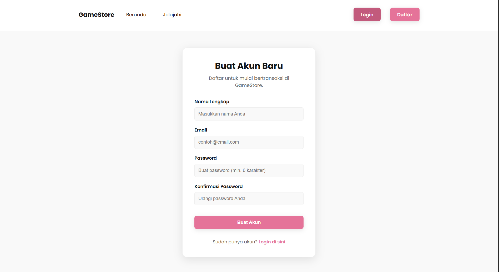

Fitur ini adalah gerbang bagi pengunjung untuk menjadi anggota komunitas Game Store. Prosesnya dirancang agar cepat dan mudah.

-   **Prasyarat:** Pengguna harus memiliki alamat email yang aktif dan unik (belum terdaftar di sistem).
-   **Detail Elemen UI:**
    -   `Username`: Nama unik yang akan menjadi identitas pengguna di platform.
    -   `Email`: Digunakan untuk komunikasi dan notifikasi. Harus valid.
    -   `Password`: Kata sandi untuk mengamankan akun. Sebaiknya mengikuti standar keamanan minimum.
    -   `Tombol Register`: Tombol final untuk mengirimkan data pendaftaran.
-   **Alur Proses &amp; Hasil:**
    1.  Pengguna mengklik "Register" di menu utama dan mengisi semua kolom pada formulir.
    2.  **Jika Sukses:** Setelah menekan "Register", data divalidasi. Akun baru dibuat, dan pengguna akan dialihkan ke halaman Login.
    3.  **Jika Gagal:** Jika username/email sudah ada atau data tidak valid, sistem akan menampilkan pesan error di halaman yang sama.

---

### Login Pengguna (`login.php`)

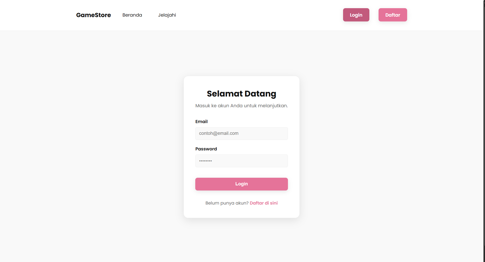

Halaman ini adalah gerbang masuk bagi pengguna yang sudah terdaftar untuk mengakses fungsionalitas khusus anggota.

-   **Prasyarat:** Akun pengguna harus sudah ada dan aktif di database.
-   **Detail Elemen UI:**
    -   `Username`: Kolom untuk memasukkan username unik yang telah didaftarkan.
    -   `Password`: Kolom untuk memasukkan kata sandi rahasia yang terasosiasi dengan akun tersebut.
    -   `Tombol Login`: Tombol untuk memverifikasi kredensial yang dimasukkan.
-   **Alur Proses &amp; Hasil:**
    1.  Pengguna mengakses halaman Login dan memasukkan kredensialnya.
    2.  **Jika Sukses:** Sistem memvalidasi kredensial, membuat sesi (session), dan mengarahkan pengguna ke halaman utama. Menu navigasi akan diperbarui.
    3.  **Jika Gagal:** Sistem akan menampilkan pesan error "Kredensial tidak valid" dan proses login tidak dilanjutkan.

---

### Tampilan Listing Game (`listing.php`)

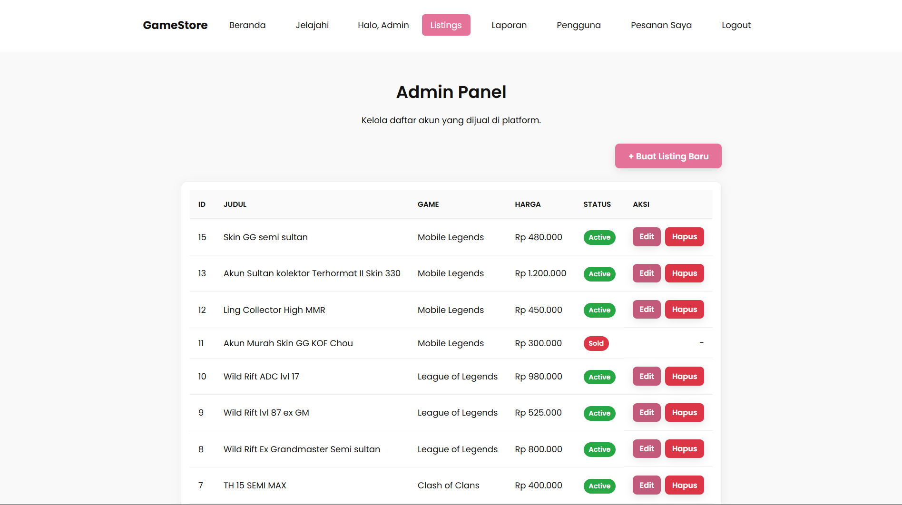

Ini adalah etalase utama dari Game Store, tempat semua produk yang dijual oleh komunitas ditampilkan dalam format galeri yang mudah dinavigasi.

-   **Prasyarat:** Halaman ini dapat diakses publik.
-   **Detail Elemen UI:**
    -   **Kartu Produk:** Setiap game ditampilkan sebagai "kartu" yang berisi gambar sampul, nama, dan harga.
    -   **Link Detail:** Seluruh area kartu dapat diklik untuk menuju halaman detail produk.
-   **Alur Proses &amp; Hasil:**
    1.  Pengguna mengklik menu "Listing".
    2.  Sistem mengambil semua data produk dari database dan menampilkannya.
    3.  Pengguna dapat scroll dan mengklik game yang menarik untuk melihat detailnya.

---

### Detail Listing Game (`listing_detail.php`)

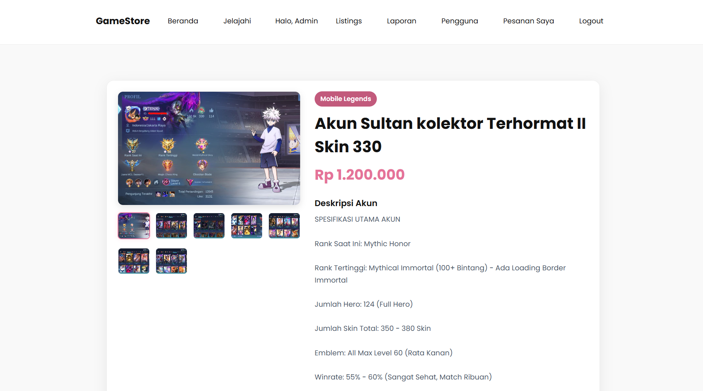

Saat melihat listing milik sendiri, pengguna diberikan alat untuk mengelolanya secara langsung.

-   **Prasyarat:** Pengguna harus login dan menjadi pemilik dari listing yang sedang dilihat.
-   **Detail Elemen UI:**
    -   **Tombol `Edit Listing`:** Mengarahkan pengguna ke halaman formulir edit.
    -   **Tombol `Delete Listing`:** Tombol untuk menghapus listing ini secara permanen.
-   **Alur Proses &amp; Hasil:**
    1.  Sistem mengenali pengguna sebagai pemilik dan menampilkan tombol `Edit` serta `Delete`.
    2.  Pengguna dapat mengklik tombol tersebut untuk mengelola listingnya.

---


### Detail Listing (Perspektif Pembeli)


Halaman ini adalah pandangan mendalam terhadap satu item spesifik, memberikan informasi yang kaya dan lengkap kepada calon pembeli.

-   **Prasyarat:** Tidak ada. Halaman ini publik.
-   **Detail Elemen UI:**
    -   **Gambar Produk:** Tampilan besar dari gambar sampul game.
    -   **Informasi Penjual:** Nama penjual ditampilkan, berfungsi sebagai link ke profil publiknya.
    -   **Deskripsi &amp; Harga:** Penjelasan detail dan harga yang ditetapkan oleh penjual.
    -   **Tombol Aksi (Beli/Pesan):** Tombol utama yang memulai alur proses pembelian.
-   **Alur Proses &amp; Hasil:**
    1.  Pengguna membaca informasi yang tersedia.
    2.  Jika tertarik, pengguna mengklik tombol "Beli".
    3.  Sistem akan membawanya ke alur konfirmasi pesanan. Jika belum login, pengguna akan diarahkan ke halaman Login terlebih dahulu.

---

### Membuat Listing Baru (`create_listing.php`)

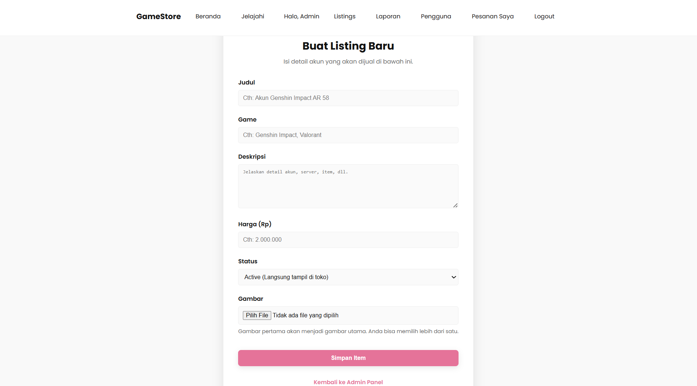

Fitur inti bagi penjual untuk mempublikasikan game yang ingin mereka jual.

-   **Prasyarat:** Pengguna **wajib** dalam keadaan login.
-   **Detail Elemen UI:**
    -   `Nama Game`, `Deskripsi`, `Harga`: Kolom-kolom untuk detail produk.
    -   `Upload Gambar`: Fitur untuk mengunggah gambar sampul.
    -   `Tombol Submit`: Mempublikasikan listing.
-   **Alur Proses &amp; Hasil:**
    1.  Pengguna mengisi formulir dan mengunggah gambar.
    2.  Setelah "Submit", data disimpan dan listing baru akan muncul di galeri utama.
    3.  Jika gagal (data tidak lengkap), halaman akan menampilkan pesan error.

---

### Mengedit Listing (`edit_listing.php`)

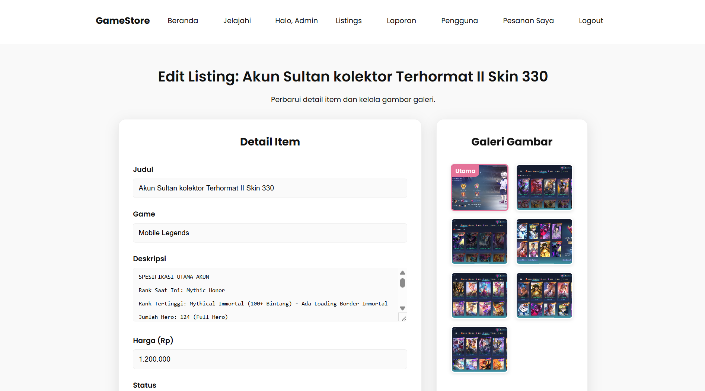

Halaman ini memungkinkan penjual untuk memperbarui informasi pada listing yang sudah ada.

-   **Prasyarat:** Pengguna harus datang dari halaman detail listing miliknya dengan mengklik tombol "Edit".
-   **Detail Elemen UI:** Formulir identik dengan halaman pembuatan, namun sudah terisi dengan data saat ini.
-   **Alur Proses &amp; Hasil:**
    1.  Pengguna mengubah informasi yang diperlukan.
    2.  Setelah menekan "Simpan Perubahan", data di database akan diperbarui.
    3.  Pengguna diarahkan kembali ke halaman detail produknya yang sudah ter-update.

---

### Halaman Pesanan Pengguna (`orders.php`)

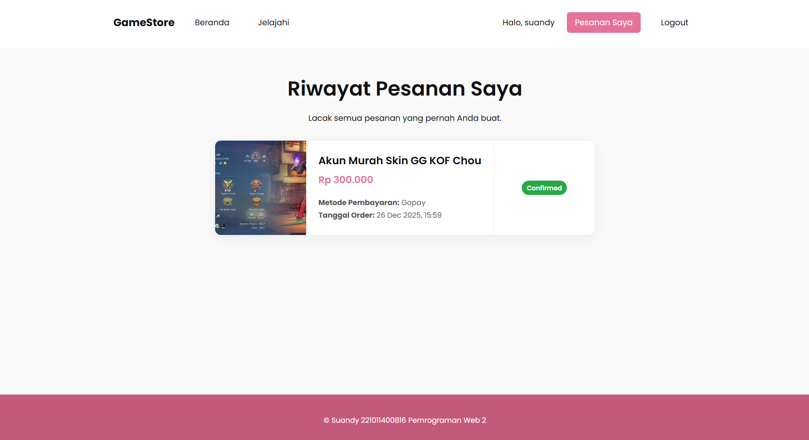

Arsip digital pribadi bagi pengguna untuk melacak semua riwayat transaksi pembelian.

-   **Prasyarat:** Pengguna harus login.
-   **Detail Elemen UI:**
    -   **Tabel Riwayat Pesanan:** Daftar item yang dibeli, ID pesanan, tanggal, dan status pesanan.
    -   **Status Pesanan:** Indikator visual (`Menunggu`, `Diproses`, `Selesai`) yang di-update oleh admin.
-   **Alur Proses &amp; Hasil:**
    1.  Pengguna mengakses halaman "Pesanan Saya".
    2.  Halaman menampilkan daftar transaksi untuk pemantauan status.

---

### Panel Admin - Manajemen Pengguna (`admin_users.php`)

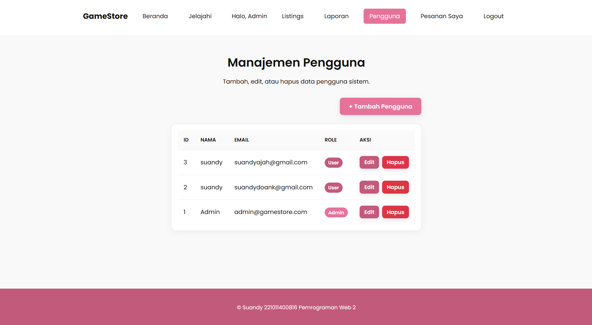

Pusat kendali bagi administrator untuk mengelola seluruh basis data pengguna.

-   **Prasyarat:** Login dengan akun berhak akses `administrator`.
-   **Detail Elemen UI:**
    -   **Tabel Pengguna:** Menampilkan daftar semua pengguna.
    -   **Fungsi Pencarian:** Untuk menemukan pengguna spesifik.
    -   **Tombol `Edit` &amp; `Delete`:** Untuk mengubah atau menghapus data pengguna.
-   **Alur Proses &amp; Hasil:**
    1.  Admin masuk ke menu "Manajemen Pengguna".
    2.  Admin dapat mencari pengguna, lalu meng-edit atau menghapus akun sesuai kebutuhan.

---

### Panel Admin - Manajemen Pesanan


Area terpusat bagi admin untuk memproses dan mengelola semua pesanan yang masuk.

-   **Prasyarat:** Login sebagai `administrator`.
-   **Detail Elemen UI:**
    -   **Tabel Pesanan Global:** Menampilkan semua pesanan dari semua pengguna.
    -   **Aksi Perubahan Status:** Dropdown atau tombol untuk mengubah status pesanan.
-   **Alur Proses &amp; Hasil:**
    1.  Admin menemukan pesanan yang relevan.
    2.  Admin mengubah statusnya (misal, dari "Diproses" menjadi "Selesai"). Perubahan ini akan terlihat oleh pengguna.

---

### Panel Admin - Laporan Penjualan (`admin_sales.php`)

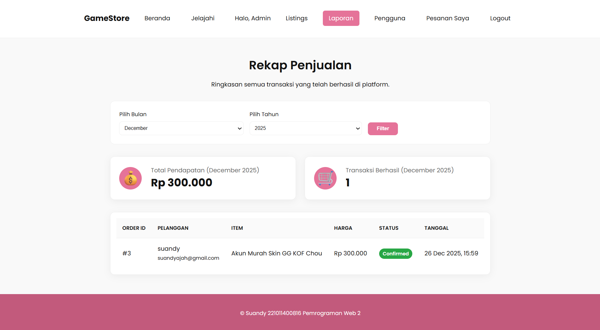

Fitur intelijen bisnis yang menyajikan data penjualan dalam bentuk visual.

-   **Prasyarat:** Login sebagai `administrator`.
-   **Detail Elemen UI:**
    -   **Grafik &amp; Ringkasan:** Menampilkan total pendapatan, jumlah transaksi, dan produk terlaris.
-   **Alur Proses &amp; Hasil:**
    1.  Admin membuka halaman "Laporan".
    2.  Sistem secara otomatis mengagregasi data transaksi menjadi wawasan yang mudah dibaca untuk analisis bisnis.

---

### Jelajahi Akun Pengguna

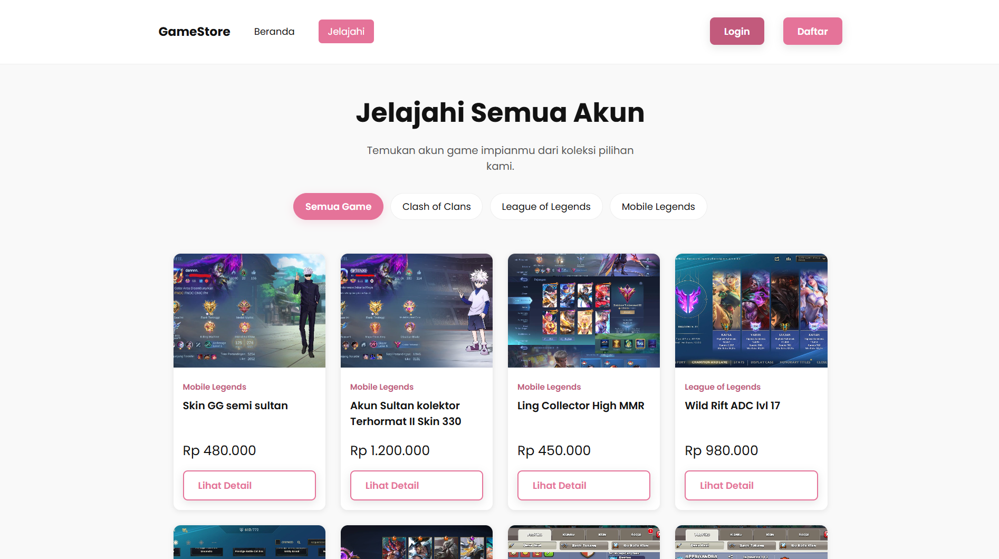

Fitur sosial untuk melihat profil publik penjual beserta semua produk yang mereka tawarkan.

-   **Prasyarat:** Tidak ada, profil publik bisa diakses siapa saja.
-   **Detail Elemen UI:**
    -   **Info Profil:** Nama pengguna penjual.
    -   **Galeri Listing Pengguna:** Etalase mini khusus untuk produk-produk dari satu penjual.
-   **Alur Proses &amp; Hasil:**
    1.  Pengguna mengklik nama penjual di halaman detail produk.
    2.  Pengguna diarahkan ke halaman profil penjual untuk melihat semua penawarannya.
